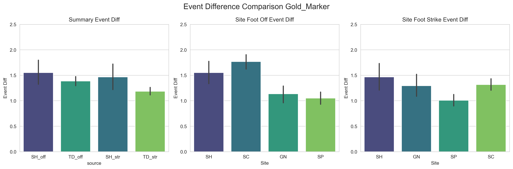
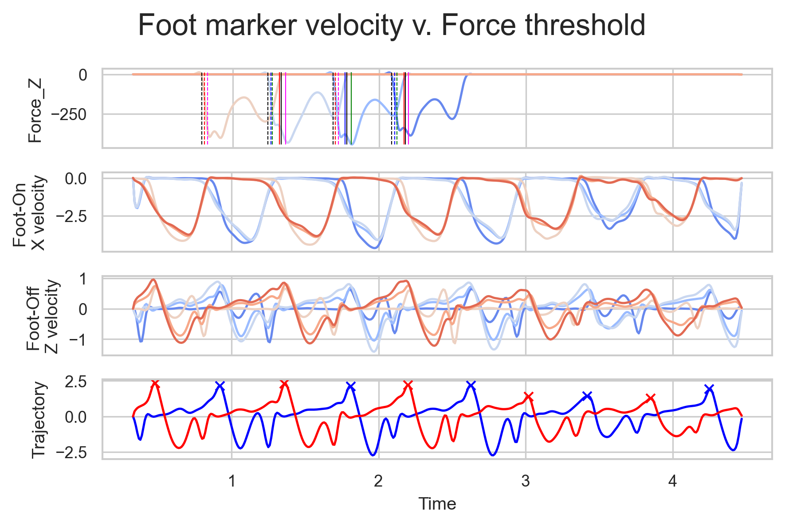

# Gait_Event_check
This project has two primary functions.
1. To auto-detect gait events - When the foot of a walker hits the ground (i.e. foot contact) and when the foot leaves the ground (i.e. foot off).
'''python
  get_AutoEvents.py
'''
3. To compare events identified from the auto-detect method with both event identified manually (i.e. Gold Standard) or by force plate threshold of 10 Newtons.
'''python
  check_EventTiming.py
'''

# Overview of Auto-Detection
This project is the start of a larger machine learning project to auto-detect events for clinical walking trials. The below auto-detect operations represent a proof-of-concept using simple feature extraction of gait event-related data transformations. Future work will involve more sophisticaed feature extraction for use in the machine learning model.

The first plot here shows how a simple method can quite accurately identify gait events in a typically developing cohort. The data compared is that of typical walkers at a single site versus a larger dataset of typically developing data pre-validated and used in clinical capture. 

This plot shows cross-validation (between sites) as well as between methods (force, auto, and manual).

### Summary Plot
The panel on the left shows the results of comparions between a single site 'SH' versus the validated dataset 'TD' for foot off '_off' and foot contact '_str' events.

The middle and right panels demonstrate the consistency between all labs that have been tested for foot off events (middle panel) and foot contact (also called 'Strike' events, right panel).

Event differences are in the units of the number of frames of camera data, captured at 100 Hz.

## Summary of Auto-Detect Methods

## Foot Contact
When walking in the laboratory, the markers on the foot move in space and time through the lab. When the foot swings forward to advance for the next step, anterior velocities become large shortly after initial foot off then rapidly slow until the foot contacts the ground. After initial contact, the anterior marker velocities are approximately zero for a short time before they accelerate again for the next step.

The foot contact event is found by finding the frame when the marker on the heel of the walker drops below a threshold value of 35% of the max anterior velocity of the marker. 

## Foot Off
Foot off is calculated in a similar way. As the body progresses forwards and the trailing foot accelerates the body center of mass, the foot begins to roll forward. When the position and velocity of the center of mass have progressed sufficiently in the anterior direction, the trailing foot can be lifted from the ground. At the time of trailing lift foot off, the summed vertical velocity of three markers on the foot reach a peak approximately equal to the instant of the foot off event.

The foot off event is found by finding the peak value of the summed vertical velocity of the three foot markers.

# Visual of event detection comparison
In the figure below, an example is given of one set of events compared for a single walk through the lab. 

### Force trajectories and identified events
The first row of the plot demonstrates the vertical ground reaction forces of the imbeded force plates in the lab, with the dotted lines indicating identified foot contact events and the solid lines indicating the foot off events. Black lines are 10 Newton threshold identified events from ground reaction force data. Red and magenta lines indicate the manually identified and auto-detected events for the right limb. Blue and green lines indicate the manually identified and auto-detected events for the left limb.

The second row of the plot shows the anterior (X-direction in lab space) velocity of three foot markers where the sharp decrease in velocity following the peak indicates the foot slowing and reaching approximately zero at and following foot contact.

The third row shows the individual foot marker velocities in the vertical direction, whereas the last row shows the summed vertical velocities for each foot (right red, left blue) with an 'X' indicating the peak value.

